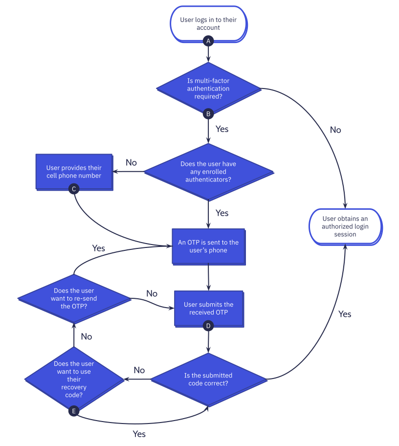

<ol type="A">
  <li>
    Frontend performs <code><a href="login.md">POST /auth/login</a></code>.
  </li>
  <li>
    Frontend performs <code><a href="mfa/challenge.md">POST /auth/mfa/challenge</a></code>.
  </li>
  <li>
    Frontend performs <code><a href="mfa/enroll.md">POST /auth/mfa/enroll</a></code>.
  </li>
  <li>
    Frontend performs <code><a href="mfa/verify.md">POST /auth/mfa/verify</a></code>.
  </li>
  <li>
    Frontend performs <code><a href="mfa/recover.md">POST /auth/mfa/recover</a></code>.
  </li>
</ol>
